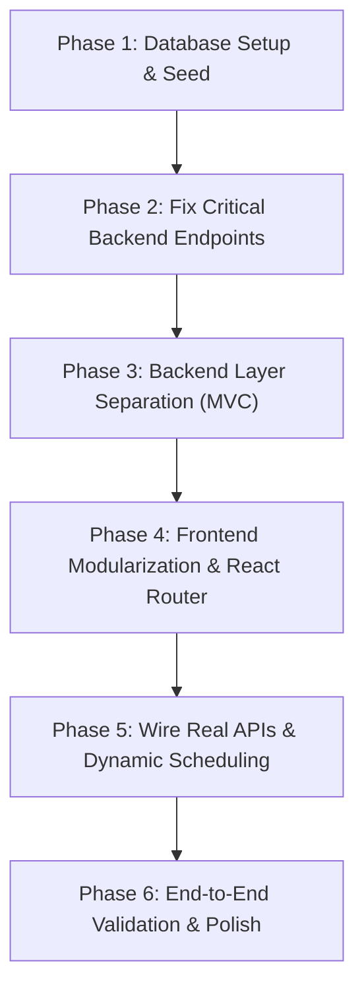

# Service Marketplace & Booking Platform
## Complete Architectural Specification, Codebase Audit & Production Implementation Guide

---

## 1. Executive Overview & Requirement Alignment

### 1.1 Assignment Brief
* **Project Title:** Service Marketplace & Booking Platform
* **Core Concept:** A multi-sided marketplace connecting customers with local and professional service providers (home cleaning, electrical, plumbing, tutoring, etc.), featuring dynamic calendar scheduling, provider workflow management, verified reviews/ratings, and a comprehensive administration dashboard.
* **Target Tech Stack:** React / Next.js • Node.js / Express • MySQL • JWT Authentication • REST APIs.

### 1.2 Alignment Status Summary

| Area | Match Level | Status & Notes |
| :--- | :---: | :--- |
| **Tech Stack** | 100% | React 19 (Vite), Node.js (Express 5), MySQL (`mysql2/promise`), JWT (`jsonwebtoken`), TailwindCSS, Lucide Icons, Recharts. |
| **Visual Scope** | 90% | UI exists for all 7 key features (Browse, Profiles, Booking, Customer Dashboard, Provider Dashboard, Admin Portal). |
| **Functional Execution** | **~40%** | **Heavily fragmented.** Core workflows rely on mock fallback data, broken status string logic, read-only UI components, missing backend endpoints, and zero API protection. |

---

## 2. In-Depth Codebase Audit: Current State & Critical Bugs

The existing codebase consists of two root directories: `backend/` and `frontend/`. Below is the complete catalog of defects, design flaws, and blocking bugs identified across the repository.

### 2.1 Critical Runtime & Logic Bugs

#### Bug #1: Hardcoded Customer & Provider Booking Filter
* **Location:** `frontend/src/App.jsx` (Lines 3986–3990)
* **Problem:** 
  ```javascript
  const myBookings = user
    ? user.role === "provider"
      ? bookings.filter(b => b.providerName === "Meera Kulkarni")
      : bookings.filter(b => b.customerName === user.name || b.customerName === "Sanket Abhang")
    : [];
  ```
* **Impact:** Any newly registered customer or provider will see an empty dashboard or someone else's bookings because the UI filters bookings by hardcoded developer names rather than matching the authenticated user ID (`user.id`).

---

#### Bug #2: Missing `customerId` Mapping from Backend Payload
* **Location:** `frontend/src/App.jsx` (Lines 3753–3778)
* **Problem:** 
  When mapping the response from `GET /api/bookings`:
  ```javascript
  const formattedBookings = data.bookings.map(b => ({
    id: b.id,
    providerId: b.provider_id,
    providerName: b.provider_name || b.business_name || "Provider",
    customerName: b.customer_name,
    // b.customer_id is NOT mapped to customerId!
    ...
  }));
  ```
* **Impact:** In `CustomerDashboard`, `b.customerId === user?.id` always evaluates to `false` for loaded database records, rendering the customer bookings table permanently blank.

---

#### Bug #3: Status String Mismatch Resets Bookings to "Requested"
* **Location:** `frontend/src/App.jsx` (Line 1707 vs Line 3916)
* **Problem:**
  In `ProviderDashboard`, the "Start job" button calls:
  ```javascript
  onUpdateStatus(b.id, "in-progress"); // Hyphenated string
  ```
  In `handleUpdateStatus`, the handler performs:
  ```javascript
  const dbStatus =
    status === "confirmed" ? "Confirmed"
    : status === "in_progress" ? "In Progress" // Expects underscore!
    : status === "completed" ? "Completed"
    : status === "cancelled" ? "Cancelled"
    : "Requested"; // Fallthrough!
  ```
* **Impact:** When a provider clicks "Start job", `"in-progress"` fails the equality check and falls through to `"Requested"`, reverting the job in the database.

---

#### Bug #4: Incomplete Provider Registration (Orphaned Accounts)
* **Location:** `backend/routes/auth.js` (Lines 19–91)
* **Problem:** When a user registers with `role: "provider"`, `auth.js` only executes an `INSERT INTO users`. It **never creates an entry in the `providers` table**.
* **Impact:** When the marketplace runs `SELECT * FROM providers p JOIN users u ON p.user_id = u.id`, new providers never appear in search results, and `providers.find(p => p.user_id === user.id)` evaluates to `undefined`, breaking the provider dashboard.

---

#### Bug #5: Missing Backend Authentication Middleware (Zero Security)
* **Location:** `backend/server.js` and `backend/routes/auth.js`
* **Problem:** While `jwt.sign()` generates a JWT upon login and the frontend stores it in `localStorage`, **not a single route in `server.js` validates the token**.
* **Impact:** All endpoints (`/api/bookings`, `/api/admin/*`, `/api/reviews`) are completely unprotected. Any unauthenticated client or guest can read, modify, or delete admin categories, toggle user accounts, or alter booking statuses.

---

#### Bug #6: Provider Profile Reviews are Static Mock Data
* **Location:** `frontend/src/App.jsx` (Line 660)
* **Problem:**
  ```javascript
  const providerReviews = REVIEWS.filter(r => r.providerId === provider.id);
  ```
* **Impact:** The profile page reads reviews from a static JavaScript constant (`REVIEWS`). Reviews submitted by real customers into MySQL via `POST /api/reviews` are never displayed on the provider's public profile page.

---

#### Bug #7: Provider Availability is Purely Read-Only
* **Location:** `frontend/src/App.jsx` (Lines 1718–1748) & `backend/server.js`
* **Problem:** The availability UI renders clickable-looking pills without `onClick` listeners, and `backend/server.js` has no `POST` or `PUT` endpoints for availability.
* **Impact:** Providers cannot set, adjust, or toggle their working hours.

---

#### Bug #8: Client-Only Cancellation Without Backend Synchronization
* **Location:** `frontend/src/App.jsx` (Line 3909)
* **Problem:**
  ```javascript
  const handleCancel = (id) => setBookings(prev => prev.map(b => b.id === id ? { ...b, status: "cancelled" } : b));
  ```
* **Impact:** Clicking "Cancel request" modifies React component state only. No network request is dispatched to `PUT /api/bookings/:id/status`, so the booking remains active in the database.

---

#### Bug #9: Booking Flow Omits Address & Special Notes
* **Location:** `frontend/src/App.jsx` (Lines 1119–1458)
* **Problem:** The SQL table has `address` and `notes` columns, but `BookingFlowPage` does not provide inputs for them, sending `null` to the backend.

---

### 2.2 Structural Deficiencies

1. **Monolithic Frontend:** `frontend/src/App.jsx` exceeds 4,048 lines, housing styles, mocks, shared helpers, and 7 entire page views in a single file without routing or state modularity.
2. **Monolithic Backend:** `backend/server.js` contains over 1,070 lines with inline SQL queries, lacking route controllers, service abstractions, or middleware layers.
3. **No Dynamic Conflict Check:** No check exists to prevent double-booking the same provider on the same date and time slot.

---

## 3. Production Architecture Blueprint

### 3.1 Target Directory Tree

```text
service-marketplace/
├── backend/
│   ├── src/
│   │   ├── config/
│   │   │   └── db.js                 # MySQL pool connection with promise interface
│   │   ├── controllers/
│   │   │   ├── authController.js     # Register, Login, Refresh, Me
│   │   │   ├── providerController.js # Profile CRUD, Services, Availability
│   │   │   ├── bookingController.js  # Booking creation, Status transitions, Conflict checks
│   │   │   ├── reviewController.js   # Submit review, Provider review list
│   │   │   ├── categoryController.js # Category listings & Admin CRUD
│   │   │   └── adminController.js    # Statistics, User activation, Moderation
│   │   ├── middlewares/
│   │   │   ├── authMiddleware.js     # JWT token verification
│   │   │   ├── roleMiddleware.js     # Role guards (e.g. requireRole('admin', 'provider'))
│   │   │   ├── validateMiddleware.js # Schema validation for request bodies
│   │   │   └── errorMiddleware.js    # Global centralized error handler
│   │   ├── routes/
│   │   │   ├── authRoutes.js
│   │   │   ├── providerRoutes.js
│   │   │   ├── bookingRoutes.js
│   │   │   ├── reviewRoutes.js
│   │   │   ├── categoryRoutes.js
│   │   │   └── adminRoutes.js
│   │   ├── db/
│   │   │   ├── schema.sql            # Full DDL database schema
│   │   │   └── seeds.sql             # Realistic seed dataset
│   │   └── server.js                 # App initialization & middleware mounting
│   ├── .env.example
│   ├── package.json
│   └── package-lock.json
│
├── frontend/
│   ├── src/
│   │   ├── assets/                   # Static logos, hero images, icons
│   │   ├── components/
│   │   │   ├── common/               # Avatar, Badge, StarRating, Modal, StatusPill
│   │   │   ├── layout/               # Navbar, Footer, Sidebar
│   │   │   └── booking/              # DatePicker, TimeSlotGrid, BookingModal
│   │   ├── context/
│   │   │   ├── AuthContext.jsx       # User state, JWT persistence, login/logout
│   │   │   └── ToastContext.jsx      # Global alert notifications
│   │   ├── hooks/
│   │   │   ├── useAuth.js
│   │   │   ├── useBookings.js
│   │   │   └── useProviders.js
│   │   ├── pages/
│   │   │   ├── auth/                 # LoginPage.jsx, RegisterPage.jsx
│   │   │   ├── customer/             # BrowsePage.jsx, ProviderProfilePage.jsx, CustomerDashboardPage.jsx
│   │   │   ├── provider/             # ProviderDashboardPage.jsx, AvailabilityManagerPage.jsx, ServiceManagerPage.jsx
│   │   │   └── admin/                # AdminOverviewPage.jsx, AdminUsersPage.jsx, AdminCategoriesPage.jsx, AdminReviewsPage.jsx
│   │   ├── services/
│   │   │   ├── api.js                # Axios/Fetch client with Auth Bearer interceptor
│   │   │   ├── authService.js
│   │   │   ├── bookingService.js
│   │   │   └── providerService.js
│   │   ├── utils/
│   │   │   ├── constants.js          # Status mappings, day names
│   │   │   └── formatters.js         # Currency, dates, slot calculators
│   │   ├── App.jsx                   # React Router route definitions & protected route wrappers
│   │   ├── index.css                 # Base styles & Tailwind directives
│   │   └── main.jsx
│   ├── package.json
│   ├── vite.config.js
│   └── index.html
└── ARCHITECTURE_AND_IMPLEMENTATION_GUIDE.md
```

---

## 4. Production Database Schema & Seed Data

### 4.1 Production Schema (`backend/src/db/schema.sql`)

```sql
-- ========================================================
-- SERVICE MARKETPLACE & BOOKING PLATFORM DATABASE SCHEMA
-- ========================================================
CREATE DATABASE IF NOT EXISTS service_marketplace CHARACTER SET utf8mb4 COLLATE utf8mb4_unicode_ci;
USE service_marketplace;

-- 1. USERS TABLE
CREATE TABLE IF NOT EXISTS users (
  id INT AUTO_INCREMENT PRIMARY KEY,
  name VARCHAR(150) NOT NULL,
  email VARCHAR(191) NOT NULL UNIQUE,
  password VARCHAR(255) NOT NULL,
  role ENUM('customer', 'provider', 'admin') NOT NULL DEFAULT 'customer',
  phone VARCHAR(30) DEFAULT NULL,
  status ENUM('active', 'inactive') NOT NULL DEFAULT 'active',
  created_at TIMESTAMP DEFAULT CURRENT_TIMESTAMP,
  updated_at TIMESTAMP DEFAULT CURRENT_TIMESTAMP ON UPDATE CURRENT_TIMESTAMP,
  INDEX idx_users_email (email),
  INDEX idx_users_role (role)
) ENGINE=InnoDB;

-- 2. CATEGORIES TABLE
CREATE TABLE IF NOT EXISTS categories (
  id INT AUTO_INCREMENT PRIMARY KEY,
  name VARCHAR(100) NOT NULL UNIQUE,
  description TEXT DEFAULT NULL,
  icon VARCHAR(50) DEFAULT 'Briefcase',
  created_at TIMESTAMP DEFAULT CURRENT_TIMESTAMP
) ENGINE=InnoDB;

-- 3. PROVIDERS TABLE
CREATE TABLE IF NOT EXISTS providers (
  id INT AUTO_INCREMENT PRIMARY KEY,
  user_id INT NOT NULL UNIQUE,
  category_id INT DEFAULT NULL,
  business_name VARCHAR(150) NOT NULL,
  description TEXT DEFAULT NULL,
  location VARCHAR(150) DEFAULT NULL,
  experience INT NOT NULL DEFAULT 0,
  hourly_rate DECIMAL(10, 2) NOT NULL DEFAULT 0.00,
  rating DECIMAL(3, 2) NOT NULL DEFAULT 0.00,
  total_reviews INT NOT NULL DEFAULT 0,
  created_at TIMESTAMP DEFAULT CURRENT_TIMESTAMP,
  updated_at TIMESTAMP DEFAULT CURRENT_TIMESTAMP ON UPDATE CURRENT_TIMESTAMP,
  FOREIGN KEY (user_id) REFERENCES users(id) ON DELETE CASCADE,
  FOREIGN KEY (category_id) REFERENCES categories(id) ON DELETE SET NULL,
  INDEX idx_providers_category (category_id),
  INDEX idx_providers_rating (rating)
) ENGINE=InnoDB;

-- 4. SERVICES TABLE
CREATE TABLE IF NOT EXISTS services (
  id INT AUTO_INCREMENT PRIMARY KEY,
  provider_id INT NOT NULL,
  name VARCHAR(150) NOT NULL,
  description TEXT DEFAULT NULL,
  price DECIMAL(10, 2) NOT NULL,
  duration INT NOT NULL DEFAULT 60, -- minutes
  created_at TIMESTAMP DEFAULT CURRENT_TIMESTAMP,
  FOREIGN KEY (provider_id) REFERENCES providers(id) ON DELETE CASCADE,
  INDEX idx_services_provider (provider_id)
) ENGINE=InnoDB;

-- 5. AVAILABILITY TABLE
CREATE TABLE IF NOT EXISTS availability (
  id INT AUTO_INCREMENT PRIMARY KEY,
  provider_id INT NOT NULL,
  day_of_week ENUM('Monday', 'Tuesday', 'Wednesday', 'Thursday', 'Friday', 'Saturday', 'Sunday') NOT NULL,
  start_time TIME NOT NULL,
  end_time TIME NOT NULL,
  created_at TIMESTAMP DEFAULT CURRENT_TIMESTAMP,
  FOREIGN KEY (provider_id) REFERENCES providers(id) ON DELETE CASCADE,
  UNIQUE KEY uq_provider_day (provider_id, day_of_week)
) ENGINE=InnoDB;

-- 6. BOOKINGS TABLE
CREATE TABLE IF NOT EXISTS bookings (
  id INT AUTO_INCREMENT PRIMARY KEY,
  customer_id INT NOT NULL,
  provider_id INT NOT NULL,
  service_id INT NOT NULL,
  booking_date DATE NOT NULL,
  start_time TIME NOT NULL,
  end_time TIME DEFAULT NULL,
  address VARCHAR(255) DEFAULT NULL,
  notes TEXT DEFAULT NULL,
  status ENUM('Requested', 'Confirmed', 'In Progress', 'Completed', 'Cancelled') NOT NULL DEFAULT 'Requested',
  created_at TIMESTAMP DEFAULT CURRENT_TIMESTAMP,
  updated_at TIMESTAMP DEFAULT CURRENT_TIMESTAMP ON UPDATE CURRENT_TIMESTAMP,
  FOREIGN KEY (customer_id) REFERENCES users(id) ON DELETE CASCADE,
  FOREIGN KEY (provider_id) REFERENCES providers(id) ON DELETE CASCADE,
  FOREIGN KEY (service_id) REFERENCES services(id) ON DELETE CASCADE,
  INDEX idx_bookings_date_slot (provider_id, booking_date, start_time),
  INDEX idx_bookings_status (status)
) ENGINE=InnoDB;

-- 7. REVIEWS TABLE
CREATE TABLE IF NOT EXISTS reviews (
  id INT AUTO_INCREMENT PRIMARY KEY,
  booking_id INT NOT NULL UNIQUE,
  customer_id INT NOT NULL,
  provider_id INT NOT NULL,
  rating TINYINT NOT NULL CHECK (rating BETWEEN 1 AND 5),
  comment TEXT DEFAULT NULL,
  created_at TIMESTAMP DEFAULT CURRENT_TIMESTAMP,
  FOREIGN KEY (booking_id) REFERENCES bookings(id) ON DELETE CASCADE,
  FOREIGN KEY (customer_id) REFERENCES users(id) ON DELETE CASCADE,
  FOREIGN KEY (provider_id) REFERENCES providers(id) ON DELETE CASCADE,
  INDEX idx_reviews_provider (provider_id)
) ENGINE=InnoDB;
```

---

### 4.2 Seed Data (`backend/src/db/seeds.sql`)

```sql
USE service_marketplace;

-- Password for all seed users is: Password123!
-- Bcrypt hash ($2a$10$wT8KzQh0n80kLzL7h49dne97w0dO5kRz7y1Yp9k1R3x5G1J9o4s6C)
INSERT INTO users (id, name, email, password, role, phone, status) VALUES
(1, 'Admin System', 'admin@marketplace.com', '$2a$10$wT8KzQh0n80kLzL7h49dne97w0dO5kRz7y1Yp9k1R3x5G1J9o4s6C', 'admin', '9998887770', 'active'),
(2, 'Meera Kulkarni', 'meera@cleanpro.com', '$2a$10$wT8KzQh0n80kLzL7h49dne97w0dO5kRz7y1Yp9k1R3x5G1J9o4s6C', 'provider', '9820011223', 'active'),
(3, 'Rohan Deshmukh', 'rohan@sparkelectric.com', '$2a$10$wT8KzQh0n80kLzL7h49dne97w0dO5kRz7y1Yp9k1R3x5G1J9o4s6C', 'provider', '9820022334', 'active'),
(4, 'Sanket Abhang', 'customer@gmail.com', '$2a$10$wT8KzQh0n80kLzL7h49dne97w0dO5kRz7y1Yp9k1R3x5G1J9o4s6C', 'customer', '9820033445', 'active');

INSERT INTO categories (id, name, description) VALUES
(1, 'Home Cleaning', 'Deep cleaning, sanitized sanitization and routine upkeep'),
(2, 'Electrical', 'Wiring, fixture upgrades, appliances and safety diagnostics'),
(3, 'Plumbing', 'Leak repairs, pipe installations and drain unclogging'),
(4, 'Tutoring', 'Academic subject coaching, test preparation and languages');

INSERT INTO providers (id, user_id, category_id, business_name, description, location, experience, hourly_rate, rating, total_reviews) VALUES
(1, 2, 1, 'Kulkarni Home Services', 'Certified deep cleaning specialist with eco-friendly equipment.', 'Mumbai, MH', 6, 499.00, 4.8, 12),
(2, 3, 2, 'Spark Electricals', 'Licensed electrician for residential and commercial repairs.', 'Pune, MH', 8, 350.00, 4.9, 18);

INSERT INTO services (id, provider_id, name, description, price, duration) VALUES
(1, 1, 'Standard Home Clean', 'Thorough dusting, vacuuming and floor disinfection', 799.00, 90),
(2, 1, 'Deep Kitchen & Bath Clean', 'Degreasing, tile scrubbing and appliance sanitization', 1499.00, 150),
(3, 2, 'Electrical Inspection', 'Complete panel check and circuit safety diagnostic', 499.00, 60),
(4, 2, 'Ceiling Fan & Light Installation', 'Mounting and wiring up to 3 fixtures', 699.00, 60);

INSERT INTO availability (provider_id, day_of_week, start_time, end_time) VALUES
(1, 'Monday', '09:00:00', '17:00:00'),
(1, 'Tuesday', '09:00:00', '17:00:00'),
(1, 'Wednesday', '09:00:00', '17:00:00'),
(1, 'Thursday', '09:00:00', '17:00:00'),
(1, 'Friday', '09:00:00', '17:00:00'),
(2, 'Monday', '10:00:00', '18:00:00'),
(2, 'Tuesday', '10:00:00', '18:00:00'),
(2, 'Wednesday', '10:00:00', '18:00:00'),
(2, 'Saturday', '10:00:00', '16:00:00');

INSERT INTO bookings (id, customer_id, provider_id, service_id, booking_date, start_time, end_time, address, notes, status) VALUES
(1, 4, 1, 1, '2026-09-25', '10:00:00', '11:30:00', 'Flat 402, Sunshine Heights, Andheri West', 'Please bring vacuum cleaner.', 'Confirmed');
```

---

## 5. Complete REST API Specification

### 5.1 Authentication (`/api/auth`)

#### `POST /api/auth/register`
* **Access:** Public
* **Body:**
  ```json
  {
    "name": "Alex Smith",
    "email": "alex@example.com",
    "password": "SecurePassword123!",
    "role": "provider",
    "phone": "9876543210",
    "businessName": "Alex Appliance Care",     // Required if role === 'provider'
    "categoryId": 2,                           // Required if role === 'provider'
    "hourlyRate": 400.00                       // Optional
  }
  ```
* **Response (201 Created):**
  ```json
  {
    "success": true,
    "message": "User registered successfully",
    "token": "eyJhbGciOi...",
    "user": {
      "id": 5,
      "name": "Alex Smith",
      "email": "alex@example.com",
      "role": "provider",
      "providerId": 3
    }
  }
  ```

#### `POST /api/auth/login`
* **Access:** Public
* **Body:**
  ```json
  { "email": "customer@gmail.com", "password": "Password123!" }
  ```
* **Response (200 OK):**
  ```json
  {
    "success": true,
    "token": "eyJhbGciOi...",
    "user": {
      "id": 4,
      "name": "Sanket Abhang",
      "email": "customer@gmail.com",
      "role": "customer",
      "providerId": null
    }
  }
  ```

#### `GET /api/auth/me`
* **Access:** Private (Bearer Token)
* **Response (200 OK):** Current session user object with provider profile ID if applicable.

---

### 5.2 Providers & Services (`/api/providers`)

#### `GET /api/providers`
* **Access:** Public
* **Query Params:** `?category=cleaning&search=mumbai&minRating=4`
* **Response (200 OK):** Array of provider objects with their nested services and availability matrix.

#### `GET /api/providers/:id`
* **Access:** Public
* **Response (200 OK):** Comprehensive provider profile including verified reviews from database.

#### `PUT /api/providers/profile`
* **Access:** Private (`role: 'provider'`)
* **Body:** `{ "businessName": "...", "description": "...", "location": "...", "hourlyRate": 550 }`

#### `PUT /api/providers/availability`
* **Access:** Private (`role: 'provider'`)
* **Body:**
  ```json
  {
    "schedule": [
      { "dayOfWeek": "Monday", "startTime": "09:00", "endTime": "17:00" },
      { "dayOfWeek": "Tuesday", "startTime": "09:00", "endTime": "17:00" }
    ]
  }
  ```

#### `POST /api/providers/services` & `DELETE /api/providers/services/:serviceId`
* **Access:** Private (`role: 'provider'`)
* **Body:** `{ "name": "Deep Rug Wash", "price": 450, "duration": 45 }`

---

### 5.3 Bookings & Scheduling (`/api/bookings`)

#### `POST /api/bookings`
* **Access:** Private (`role: 'customer'`)
* **Body:**
  ```json
  {
    "providerId": 1,
    "serviceId": 1,
    "bookingDate": "2026-09-28",
    "startTime": "10:00:00",
    "address": "Flat 501, Green Acres, Powai",
    "notes": "Doorbell is broken, please call on arrival."
  }
  ```
* **Validation / Conflict Check:** Rejects request if provider is already booked for that time window with status `Confirmed` or `In Progress`.
* **Response (201 Created):** `{ "success": true, "bookingId": 12 }`

#### `GET /api/bookings`
* **Access:** Private (Filtered by `req.user.id` and `req.user.role`)
* **Response (200 OK):** Returns all bookings relevant to the calling user (as customer or provider).

#### `PUT /api/bookings/:id/status`
* **Access:** Private (`provider` or `admin`)
* **Body:** `{ "status": "Confirmed" | "In Progress" | "Completed" | "Cancelled" }`

---

### 5.4 Reviews (`/api/reviews`)

#### `POST /api/reviews`
* **Access:** Private (`role: 'customer'`)
* **Body:**
  ```json
  {
    "bookingId": 1,
    "rating": 5,
    "comment": "Outstanding service! On time and spotless clean."
  }
  ```
* **Database Action:** Atomic transaction inserting review and automatically recalculating provider average rating.

#### `GET /api/providers/:providerId/reviews`
* **Access:** Public
* **Response (200 OK):** List of verified customer reviews for this provider.

---

### 5.5 Admin Management (`/api/admin`)

* `GET /api/admin/stats` -> Platform KPIs (Total Users, Active Providers, Bookings this month, Revenue, Category distribution).
* `GET /api/admin/users` -> Complete user list with roles, ratings, and status.
* `PUT /api/admin/users/:id/status` -> Toggle user between `active` and `inactive`.
* `POST /api/admin/categories` -> Create category.
* `PUT /api/admin/categories/:id` -> Update category.
* `DELETE /api/admin/categories/:id` -> Delete category (guarded: prevents delete if providers are assigned).
* `GET /api/admin/reviews` -> Moderate reviews.

---

## 6. Core Algorithms & Logic Recipes

### 6.1 Double-Booking Prevention Algorithm
Before confirming an appointment, the backend must verify that the requested time slot does not collide with an existing non-cancelled booking.

```javascript
// Function in bookingService.js
async function checkBookingConflict(db, providerId, bookingDate, startTime, durationMinutes) {
  // Calculate end time
  const [startHour, startMin] = startTime.split(':').map(Number);
  const startTotalMins = startHour * 60 + startMin;
  const endTotalMins = startTotalMins + durationMinutes;
  
  const endHour = Math.floor(endTotalMins / 60);
  const endMin = endTotalMins % 60;
  const endTime = `${String(endHour).padStart(2, '0')}:${String(endMin).padStart(2, '0')}:00`;

  const [overlapping] = await db.query(`
    SELECT id FROM bookings
    WHERE provider_id = ?
      AND booking_date = ?
      AND status IN ('Requested', 'Confirmed', 'In Progress')
      AND (
        (start_time <= ? AND end_time > ?) OR
        (start_time < ? AND end_time >= ?) OR
        (start_time >= ? AND end_time <= ?)
      )
  `, [providerId, bookingDate, startTime, startTime, endTime, endTime, startTime, endTime]);

  return overlapping.length > 0;
}
```

---

### 6.2 Atomic Review Submission & Rating Recalculation
To prevent race conditions, the review submission and rating average recalculation are executed inside a single database transaction.

```javascript
// In reviewController.js
async function submitReview(req, res) {
  const connection = await db.getConnection();
  try {
    const { bookingId, rating, comment } = req.body;
    const customerId = req.user.id;

    await connection.beginTransaction();

    // 1. Verify booking exists, is completed, and belongs to user
    const [bookings] = await connection.query(`
      SELECT provider_id, status FROM bookings 
      WHERE id = ? AND customer_id = ?
    `, [bookingId, customerId]);

    if (bookings.length === 0 || bookings[0].status !== 'Completed') {
      await connection.rollback();
      return res.status(400).json({ success: false, message: "Valid completed booking required" });
    }

    const providerId = bookings[0].provider_id;

    // 2. Insert Review
    await connection.query(`
      INSERT INTO reviews (booking_id, customer_id, provider_id, rating, comment)
      VALUES (?, ?, ?, ?, ?)
    `, [bookingId, customerId, providerId, rating, comment]);

    // 3. Recalculate and update provider rating
    await connection.query(`
      UPDATE providers
      SET rating = (SELECT AVG(rating) FROM reviews WHERE provider_id = ?),
          total_reviews = (SELECT COUNT(*) FROM reviews WHERE provider_id = ?)
      WHERE id = ?
    `, [providerId, providerId, providerId]);

    await connection.commit();
    res.status(201).json({ success: true, message: "Review submitted successfully" });
  } catch (error) {
    await connection.rollback();
    res.status(500).json({ success: false, error: error.message });
  } finally {
    connection.release();
  }
}
```

---

### 6.3 JWT Authentication & Role Authorization Middleware
```javascript
// backend/src/middlewares/authMiddleware.js
const jwt = require('jsonwebtoken');

function authenticateToken(req, res, next) {
  const authHeader = req.headers['authorization'];
  const token = authHeader && authHeader.split(' ')[1]; // Format: "Bearer <TOKEN>"

  if (!token) {
    return res.status(401).json({ success: false, message: "Authentication required" });
  }

  jwt.verify(token, process.env.JWT_SECRET || 'service_marketplace_secret_2026', (err, user) => {
    if (err) {
      return res.status(403).json({ success: false, message: "Token is invalid or expired" });
    }
    req.user = user;
    next();
  });
}

function requireRole(...allowedRoles) {
  return (req, res, next) => {
    if (!req.user || !allowedRoles.includes(req.user.role)) {
      return res.status(403).json({ success: false, message: "Insufficient permissions" });
    }
    next();
  };
}

module.exports = { authenticateToken, requireRole };
```

---

## 7. Step-by-Step Refactoring & Implementation Roadmap

Follow this step-by-step sequence to transform the current repository into a production-ready application.



### Phase 1: Database Initialization
1. Execute `schema.sql` in local MySQL database (`service_marketplace`).
2. Execute `seeds.sql` to populate initial test users, categories, providers, and services.
3. Configure `backend/.env` with valid credentials:
   ```env
   DB_HOST=localhost
   DB_USER=root
   DB_PASSWORD=your_password
   DB_NAME=service_marketplace
   PORT=5000
   JWT_SECRET=service_marketplace_secret_2026
   ```

---

### Phase 2: Resolve Backend Hotspots
1. **Fix Provider Registration in `routes/auth.js`:** Update registration handler so that if `role === 'provider'`, it executes a secondary `INSERT INTO providers (user_id, business_name, category_id, hourly_rate)` in a transaction.
2. **Add Missing Endpoints in `server.js`:**
   * `GET /api/providers/:id/reviews` (Fetches real reviews for profile).
   * `PUT /api/providers/availability` (Saves provider working schedule).
   * `POST /api/providers/services` and `DELETE /api/providers/services/:id`.
3. **Attach Auth Middleware:** Guard `/api/admin/*`, `/api/bookings`, and `/api/reviews` with `authenticateToken`.

---

### Phase 3: Frontend Refactoring & React Router Setup
1. Install `react-router-dom`:
   ```bash
   cd frontend
   npm install react-router-dom
   ```
2. Split `App.jsx` into separate page components:
   * `src/pages/customer/BrowsePage.jsx`
   * `src/pages/customer/ProviderProfilePage.jsx`
   * `src/pages/customer/CustomerDashboardPage.jsx`
   * `src/pages/provider/ProviderDashboardPage.jsx`
   * `src/pages/admin/AdminDashboardPage.jsx`
   * `src/pages/auth/AuthPage.jsx`
3. Setup `src/context/AuthContext.jsx` to store token in `localStorage`, attach token to all `fetch`/`axios` headers, and provide `user`, `login()`, `logout()` across the app.
4. Replace hardcoded name checks (`Sanket Abhang`, `Meera Kulkarni`) with `b.customerId === user.id` and `b.providerId === provider.id`.

---

### Phase 4: Dynamic Booking & Verified Reviews Flow
1. Connect `ProviderProfilePage` to `GET /api/providers/:id/reviews`.
2. Add `address` and `notes` input fields to `BookingFlowPage`.
3. In `ProviderDashboard`, correct status triggers so `"in_progress"` is sent to match backend validation.
4. Wire "Cancel request" in customer dashboard to call `PUT /api/bookings/:id/status` with `status: "Cancelled"`.

---

## 8. End-to-End Verification Playbook

### 8.1 Customer Verification Checklist
- [ ] User can register as a new customer and log in.
- [ ] Filter providers by category and keyword search.
- [ ] View provider profile with accurate price list and database-backed reviews.
- [ ] Select service, select available date, pick open slot, enter address, and confirm booking.
- [ ] Customer dashboard reflects new booking with "Requested" status.
- [ ] Once booking is marked "Completed", customer can leave a 1–5 star rating and comment.

### 8.2 Provider Verification Checklist
- [ ] User can register as a provider and provide business name & category.
- [ ] Provider appears in marketplace search results.
- [ ] Provider can update working days and hours in Availability tab.
- [ ] Provider receives customer booking request, clicks "Accept" -> status becomes "Confirmed".
- [ ] Provider clicks "Start Job" -> status becomes "In Progress".
- [ ] Provider clicks "Mark Complete" -> status becomes "Completed", earnings card updates.

### 8.3 Admin Verification Checklist
- [ ] Admin login allows access to `/admin` dashboard.
- [ ] Total Users, Active Providers, Bookings, and Revenue KPI cards show live calculations.
- [ ] Add a new category -> category immediately available in marketplace.
- [ ] Toggle user status to "inactive" -> deactivated user cannot log in.
- [ ] View list of all platform reviews.
