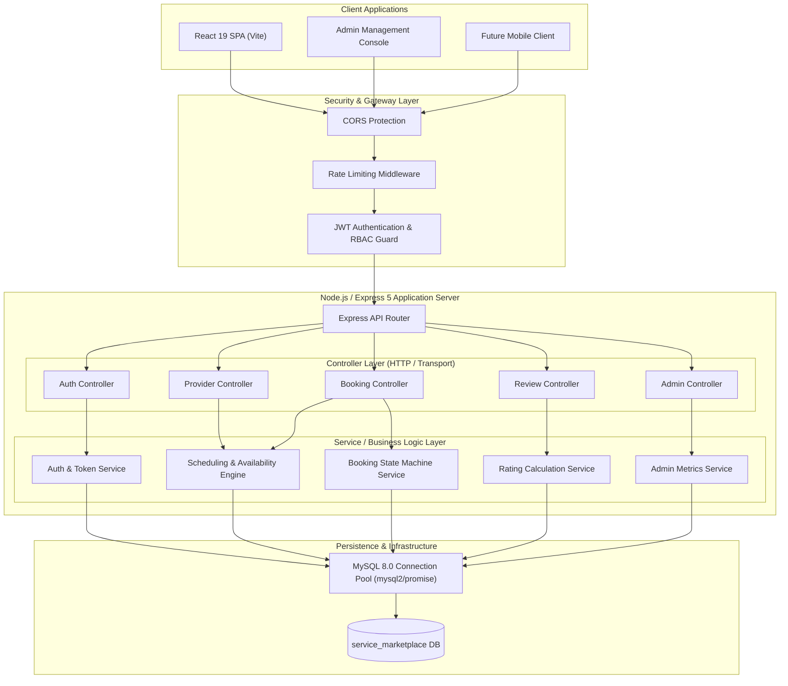

# Backend System Design Document
## Service Marketplace & Booking Platform

---

## 1. System Overview & Context

The **Service Marketplace & Booking Platform** is a multi-tenant, role-aware web service connecting **Customers** with vetted **Service Providers** across various home and professional service categories. The system handles identity & access management, dynamic calendar scheduling, booking state machines, transactional customer reviews, and platform-wide administrative monitoring.

### 1.1 System Goals
- **Reliability & Availability:** Provide reliable calendar availability querying and booking creation with sub-second response times.
- **Data Integrity & Concurrency Control:** Prevent scheduling anomalies such as double-booking the same provider on the same time slot under concurrent requests.
- **Security & Authorization:** Enforce strict Role-Based Access Control (RBAC) via stateless JSON Web Tokens (JWT) across Customer, Provider, and Admin domains.
- **Maintainability & Extensibility:** Decouple routing, business logic, and persistence layers using a layered Service-Repository / Controller-Service architecture.

---

## 2. High-Level Architecture

The backend adopts a **Layered Monolithic Architecture** communicating with a relational **MySQL** database through a connection pool. It exposes a standard **RESTful JSON API** consumed by single-page web applications (React) and potential future mobile clients.



---

## 3. Subsystem Breakdown

### 3.1 Authentication & Authorization Subsystem
- **Identity Model:** Unified `users` table with discriminator column `role` (`customer`, `provider`, `admin`).
- **Credential Storage:** One-way salted password hashing via `bcryptjs` with work factor 10.
- **Session Model:** Stateless JWT containing user claims (`id`, `email`, `role`, `providerId`). Tokens expire in 7 days.
- **Authorization Enforcement:** Middleware validates token signatures and extracts claims into `req.user`. Route guards reject requests failing role requirements (`403 Forbidden`).

### 3.2 Provider & Catalog Subsystem
- **Provider Entity:** 1:1 linked with `users`. Houses business branding, category classification, hourly base rates, geographical location, and aggregate rating metrics.
- **Services Catalog:** 1:N relationship with `providers`. Each service defines a discrete unit of work with a title, description, price, and duration in minutes.
- **Availability Matrix:** Weekly recurring template (`availability` table) storing operating hours per day of the week (`start_time` to `end_time`).

### 3.3 Scheduling & Booking Engine
- **Slot Generation:** Transforms provider working schedules into discrete booking time intervals based on service duration.
- **Conflict Prevention:** Executes transactional collision detection against existing active bookings (`Requested`, `Confirmed`, `In Progress`) for that provider on the selected date.
- **State Machine Workflow:** Strictly defined status progression:
  ```
  Requested (by Customer) 
     ├──> Cancelled (by Customer or Provider)
     └──> Confirmed (by Provider)
            ├──> In Progress (by Provider upon starting job)
            │      └──> Completed (by Provider upon finishing)
            └──> Cancelled (by Provider or Customer)
  ```

### 3.4 Reviews & Reputation Subsystem
- **Verified Reviews Only:** Reviews can only be submitted against bookings in `Completed` status by the customer who booked the service.
- **Uniqueness Constraint:** 1:1 relationship between `bookings` and `reviews` (a booking cannot be reviewed twice).
- **Atomic Aggregate Recalculation:** Submitting a review executes an atomic database transaction updating the provider's `rating` (average) and `total_reviews` (count).

### 3.5 Administration & Platform Operations
- **Metrics Aggregation:** Direct SQL aggregated queries calculating Platform Active Users, Verified Providers, Monthly Bookings Count, and Gross Platform Volume (Completed revenue).
- **Catalog Governance:** Category CRUD with dependency checks (prohibits deleting categories with active providers).
- **User Moderation:** Immediate account deactivation (`active` -> `inactive`). Deactivated accounts fail authentication on subsequent requests.

---

## 4. Cross-Cutting Technical Concerns

### 4.1 Concurrency & Race Conditions
- When multiple customers attempt to book the same provider slot simultaneously:
  - The booking creation transaction acquires a row lock or utilizes an atomic existence verification (`SELECT ... FOR UPDATE` or conditional check within an `ISOLATION LEVEL REPEATABLE READ` transaction).
  - Failed slot validations yield `409 Conflict` with clear remediation details.

### 4.2 Error Handling Strategy
- Standardized JSON Error Response Envelope:
  ```json
  {
    "success": false,
    "code": "SLOT_ALREADY_BOOKED",
    "message": "The selected time slot has already been reserved.",
    "details": null,
    "timestamp": "2026-09-21T10:30:00.000Z"
  }
  ```
- All unhandled runtime exceptions are intercepted by Express global error handling middleware, logging error stacks internally while presenting safe sanitized messages to clients.

### 4.3 Environment & Configuration Management
- Configuration is loaded via `dotenv` from `.env` and validated at process startup in `config/env.js`.
- Required keys: `PORT`, `DB_HOST`, `DB_USER`, `DB_PASSWORD`, `DB_NAME`, `DB_PORT`, `JWT_SECRET`, `CORS_ORIGIN`. Missing keys cause immediate process termination with clear diagnostic output.
