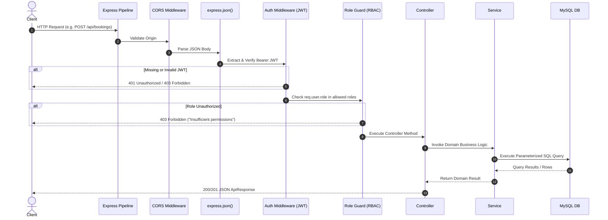

# Backend Architecture & Software Patterns
## Layered Monolith Architecture Specification

---

## 1. Architectural Style: Controller-Service-Repository

The backend application structure strictly enforces the separation of concerns:

```
[ HTTP Request ]
       │
       ▼
[ Router Layer ] ──────────── Validates HTTP method & URI path
       │
       ▼
[ Middleware Pipeline ] ───── CORS, JSON Body Parsing, JWT Auth, Role Guard, Input Validation
       │
       ▼
[ Controller Layer ] ──────── Extracts params, orchestrates HTTP status codes & responses
       │
       ▼
[ Service Layer ] ─────────── Core business rules, transactions, calculations, conflict checks
       │
       ▼
[ Persistence Layer ] ─────── SQL Queries executed against MySQL2 Connection Pool
       │
       ▼
[ HTTP Response ]
```

### 1.1 Layer Responsibilities

| Layer | Directory | Primary Role | What It Must NEVER Do |
| :--- | :--- | :--- | :--- |
| **Routes** | `src/routes/` | Bind URI paths to middleware chains and controller methods. | Never execute business logic, DB queries, or direct responses. |
| **Middlewares** | `src/middlewares/` | Cross-cutting interceptors: token verification, schema validation, rate limiting, error catching. | Never manipulate application domain entities directly. |
| **Controllers** | `src/controllers/` | Parse HTTP `req.body`/`req.params`/`req.query`, call services, format JSON response (`res.status(200).json(...)`). | Never write raw SQL queries or implement business workflows. |
| **Services** | `src/services/` | Implement application domain logic, transactions, state machines, conflict algorithms. | Never reference Express `req` or `res` objects. |
| **Database Pool** | `src/config/db.js` | Connection lifecycle, query execution, connection release. | Never contain domain-specific business logic. |

---

## 2. Directory Structure & File Inventory

```text
backend/
├── src/
│   ├── config/
│   │   ├── env.js                # Strict environment variable validation
│   │   └── db.js                 # MySQL pool initialization & health checks
│   │
│   ├── middlewares/
│   │   ├── auth.js               # JWT verification (authenticateToken)
│   │   ├── role.js               # RBAC guard (requireRole('admin', 'provider'))
│   │   ├── validate.js           # Request body/param schema validator
│   │   └── errorHandler.js       # Centralized 500/400 JSON error serializer
│   │
│   ├── controllers/
│   │   ├── authController.js     # register, login, me
│   │   ├── providerController.js # getProviders, getProviderById, updateProfile, updateAvailability, manageServices
│   │   ├── bookingController.js  # createBooking, getBookings, updateBookingStatus, cancelBooking
│   │   ├── reviewController.js   # submitReview, getProviderReviews
│   │   ├── categoryController.js # getCategories, adminAddCategory, adminEditCategory, adminDeleteCategory
│   │   └── adminController.js    # getStats, getUsers, toggleUserStatus, getAdminReviews
│   │
│   ├── services/
│   │   ├── authService.js        # User creation, password hashing, JWT generation
│   │   ├── providerService.js    # Provider profiles, services CRUD, schedule updates
│   │   ├── bookingService.js     # Time collision detection, status transitions
│   │   ├── reviewService.js      # Atomic transaction inserting review & updating ratings
│   │   └── adminService.js       # KPI metrics aggregation & user moderation
│   │
│   ├── routes/
│   │   ├── authRoutes.js         # /api/auth/*
│   │   ├── providerRoutes.js     # /api/providers/*
│   │   ├── bookingRoutes.js      # /api/bookings/*
│   │   ├── reviewRoutes.js       # /api/reviews/*
│   │   ├── categoryRoutes.js     # /api/categories/*
│   │   └── adminRoutes.js        # /api/admin/*
│   │
│   ├── db/
│   │   ├── schema.sql            # Master database DDL schema
│   │   └── seeds.sql             # Comprehensive seed data
│   │
│   ├── utils/
│   │   ├── apiResponse.js        # Consistent success & error response factories
│   │   └── timeHelpers.js        # Slot calculations, 12h/24h time formatters
│   │
│   ├── app.js                    # Express app configuration (without listen)
│   └── server.js                 # Server entrypoint (initializes DB then listens)
├── .env.example
├── package.json
└── README.md
```

---

## 3. Core Design Patterns

### 3.1 Consistent API Response Wrapper
All endpoints return a predictable JSON envelope structure:

```javascript
// src/utils/apiResponse.js
class ApiResponse {
  static success(res, data = null, message = "Operation successful", statusCode = 200) {
    return res.status(statusCode).json({
      success: true,
      message,
      data,
    });
  }

  static error(res, message = "Internal server error", statusCode = 500, errors = null) {
    return res.status(statusCode).json({
      success: false,
      message,
      errors,
    });
  }
}
module.exports = ApiResponse;
```

### 3.2 Transaction Management Pattern
When operations require multi-table updates (e.g., submitting a review and updating average ratings, or registering a user as a provider):

```javascript
// Standard Database Transaction Pattern
const db = require('../config/db');

async function executeTransaction(callback) {
  const connection = await db.getConnection();
  try {
    await connection.beginTransaction();
    const result = await callback(connection);
    await connection.commit();
    return result;
  } catch (error) {
    await connection.rollback();
    throw error;
  } finally {
    connection.release();
  }
}
```

### 3.3 Centralized Error Handling Pattern
Custom error classes capture specific HTTP semantics:

```javascript
// src/utils/errors.js
class AppError extends Error {
  constructor(message, statusCode) {
    super(message);
    this.statusCode = statusCode;
    this.isOperational = true;
  }
}

class BadRequestError extends AppError { constructor(msg) { super(msg, 400); } }
class UnauthorizedError extends AppError { constructor(msg = "Unauthorized") { super(msg, 41); } }
class ForbiddenError extends AppError { constructor(msg = "Forbidden") { super(msg, 403); } }
class NotFoundError extends AppError { constructor(msg = "Resource not found") { super(msg, 404); } }
class ConflictError extends AppError { constructor(msg) { super(msg, 409); } }
```

The Express error middleware catches these without crashing the server:

```javascript
// src/middlewares/errorHandler.js
module.exports = (err, req, res, next) => {
  const statusCode = err.statusCode || 500;
  const message = err.message || "Internal Server Error";

  if (process.env.NODE_ENV !== 'production' && statusCode === 500) {
    console.error("UNHANDLED ERROR:", err);
  }

  res.status(statusCode).json({
    success: false,
    message,
    ...(process.env.NODE_ENV !== 'production' && { stack: err.stack }),
  });
};
```

---

## 4. Middleware Execution Sequence

Every inbound HTTP request traverses this sequential pipeline:


