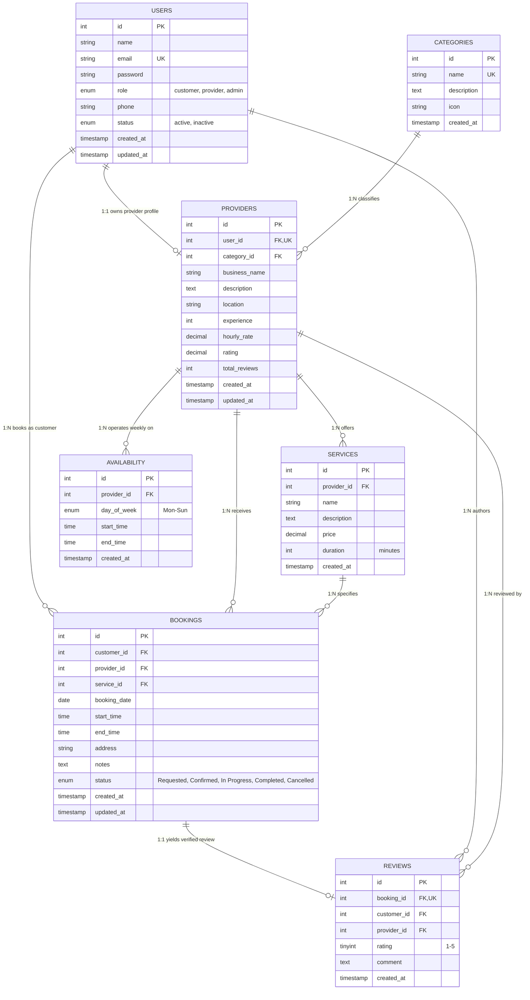

# Database Design & Relational Data Model
## Service Marketplace Relational Database Specification

---

## 1. Entity-Relationship (ER) Diagram



---

## 2. Table Specifications & Column DDL

### 2.1 `users` Table
Stores identity credentials, core contact details, and account authorization roles.

| Column | Type | Nullable | Default | Constraints / Description |
| :--- | :--- | :---: | :--- | :--- |
| `id` | `INT` | No | Auto Increment | Primary Key |
| `name` | `VARCHAR(150)` | No | None | Display name of the person or administrator |
| `email` | `VARCHAR(191)` | No | None | Unique constraint; primary login identifier |
| `password` | `VARCHAR(255)` | No | None | Bcrypt hash (length 60 chars minimum) |
| `role` | `ENUM` | No | `'customer'` | `'customer'`, `'provider'`, `'admin'` |
| `phone` | `VARCHAR(30)` | Yes | `NULL` | Contact phone number |
| `status` | `ENUM` | No | `'active'` | `'active'`, `'inactive'` (moderation toggle) |
| `created_at`| `TIMESTAMP` | No | `CURRENT_TIMESTAMP` | Account registration timestamp |
| `updated_at`| `TIMESTAMP` | No | `CURRENT_TIMESTAMP ON UPDATE CURRENT_TIMESTAMP` | Last updated timestamp |

* **Indexes:**
  - `PRIMARY KEY (id)`
  - `UNIQUE KEY uq_users_email (email)`
  - `KEY idx_users_role (role)`
  - `KEY idx_users_status (status)`

---

### 2.2 `categories` Table
Hierarchical or flat classification for marketplace discovery.

| Column | Type | Nullable | Default | Constraints / Description |
| :--- | :--- | :---: | :--- | :--- |
| `id` | `INT` | No | Auto Increment | Primary Key |
| `name` | `VARCHAR(100)` | No | None | Unique category title (e.g. "Home Cleaning") |
| `description`| `TEXT` | Yes | `NULL` | Detailed scope of the category |
| `icon` | `VARCHAR(50)` | Yes | `'Briefcase'` | Lucide icon identifier |
| `created_at` | `TIMESTAMP` | No | `CURRENT_TIMESTAMP` | Creation timestamp |

* **Indexes:**
  - `PRIMARY KEY (id)`
  - `UNIQUE KEY uq_categories_name (name)`

---

### 2.3 `providers` Table
Extends a `user` account with commercial metadata, ratings, and category classification.

| Column | Type | Nullable | Default | Constraints / Description |
| :--- | :--- | :---: | :--- | :--- |
| `id` | `INT` | No | Auto Increment | Primary Key |
| `user_id` | `INT` | No | None | Foreign Key -> `users(id)` ON DELETE CASCADE; 1:1 Unique |
| `category_id`| `INT` | Yes | `NULL` | Foreign Key -> `categories(id)` ON DELETE SET NULL |
| `business_name`| `VARCHAR(150)` | No | None | Commercial brand or sole proprietor trade name |
| `description`| `TEXT` | Yes | `NULL` | Provider biography, credentials, specialties |
| `location` | `VARCHAR(150)` | Yes | `NULL` | City or service radius (e.g. "Mumbai, MH") |
| `experience`| `INT` | No | `0` | Years of industry experience |
| `hourly_rate`| `DECIMAL(10,2)`| No | `0.00` | Base hourly rate |
| `rating` | `DECIMAL(3,2)`| No | `0.00` | Running weighted average rating (1.00 - 5.00) |
| `total_reviews`| `INT` | No | `0` | Running count of submitted customer reviews |
| `created_at`| `TIMESTAMP` | No | `CURRENT_TIMESTAMP` | Profile creation timestamp |
| `updated_at`| `TIMESTAMP` | No | `CURRENT_TIMESTAMP ON UPDATE CURRENT_TIMESTAMP` | Last profile update |

* **Indexes:**
  - `PRIMARY KEY (id)`
  - `UNIQUE KEY uq_providers_user (user_id)`
  - `KEY idx_providers_category (category_id)`
  - `KEY idx_providers_rating (rating)`

---

### 2.4 `services` Table
Discrete bookable packages offered by a specific provider.

| Column | Type | Nullable | Default | Constraints / Description |
| :--- | :--- | :---: | :--- | :--- |
| `id` | `INT` | No | Auto Increment | Primary Key |
| `provider_id`| `INT` | No | None | Foreign Key -> `providers(id)` ON DELETE CASCADE |
| `name` | `VARCHAR(150)` | No | None | Service title (e.g. "Deep Bathroom Sanitization") |
| `description`| `TEXT` | Yes | `NULL` | Description of scope, supplies included, etc. |
| `price` | `DECIMAL(10,2)`| No | None | Fixed price for this package |
| `duration` | `INT` | No | `60` | Estimated service duration in minutes |
| `created_at` | `TIMESTAMP` | No | `CURRENT_TIMESTAMP` | Creation timestamp |

* **Indexes:**
  - `PRIMARY KEY (id)`
  - `KEY idx_services_provider (provider_id)`

---

### 2.5 `availability` Table
Defines operating schedule hours for recurring days of the week.

| Column | Type | Nullable | Default | Constraints / Description |
| :--- | :--- | :---: | :--- | :--- |
| `id` | `INT` | No | Auto Increment | Primary Key |
| `provider_id`| `INT` | No | None | Foreign Key -> `providers(id)` ON DELETE CASCADE |
| `day_of_week`| `ENUM` | No | None | `'Monday'`, `'Tuesday'`, `'Wednesday'`, `'Thursday'`, `'Friday'`, `'Saturday'`, `'Sunday'` |
| `start_time` | `TIME` | No | None | Shift start (e.g. `09:00:00`) |
| `end_time` | `TIME` | No | None | Shift end (e.g. `17:00:00`) |
| `created_at` | `TIMESTAMP` | No | `CURRENT_TIMESTAMP` | Creation timestamp |

* **Indexes:**
  - `PRIMARY KEY (id)`
  - `UNIQUE KEY uq_provider_day (provider_id, day_of_week)`

---

### 2.6 `bookings` Table
Core transactional entity tracking a service engagement.

| Column | Type | Nullable | Default | Constraints / Description |
| :--- | :--- | :---: | :--- | :--- |
| `id` | `INT` | No | Auto Increment | Primary Key |
| `customer_id`| `INT` | No | None | Foreign Key -> `users(id)` ON DELETE CASCADE |
| `provider_id`| `INT` | No | None | Foreign Key -> `providers(id)` ON DELETE CASCADE |
| `service_id` | `INT` | No | None | Foreign Key -> `services(id)` ON DELETE CASCADE |
| `booking_date`| `DATE` | No | None | Date of appointment (`YYYY-MM-DD`) |
| `start_time` | `TIME` | No | None | Appointment scheduled start time |
| `end_time` | `TIME` | Yes | `NULL` | Calculated end time (`start_time + duration`) |
| `address` | `VARCHAR(255)` | Yes | `NULL` | Physical location where service is rendered |
| `notes` | `TEXT` | Yes | `NULL` | Customer instructions or provider remarks |
| `status` | `ENUM` | No | `'Requested'` | `'Requested'`, `'Confirmed'`, `'In Progress'`, `'Completed'`, `'Cancelled'` |
| `created_at` | `TIMESTAMP` | No | `CURRENT_TIMESTAMP` | Booking creation timestamp |
| `updated_at` | `TIMESTAMP` | No | `CURRENT_TIMESTAMP ON UPDATE CURRENT_TIMESTAMP` | Last status change timestamp |

* **Indexes:**
  - `PRIMARY KEY (id)`
  - `KEY idx_bookings_customer (customer_id)`
  - `KEY idx_bookings_provider_date_slot (provider_id, booking_date, start_time)`
  - `KEY idx_bookings_status (status)`

---

### 2.7 `reviews` Table
Verified ratings and qualitative customer feedback.

| Column | Type | Nullable | Default | Constraints / Description |
| :--- | :--- | :---: | :--- | :--- |
| `id` | `INT` | No | Auto Increment | Primary Key |
| `booking_id` | `INT` | No | None | Foreign Key -> `bookings(id)` ON DELETE CASCADE; 1:1 Unique |
| `customer_id`| `INT` | No | None | Foreign Key -> `users(id)` ON DELETE CASCADE |
| `provider_id`| `INT` | No | None | Foreign Key -> `providers(id)` ON DELETE CASCADE |
| `rating` | `TINYINT` | No | None | Integer between 1 and 5 |
| `comment` | `TEXT` | Yes | `NULL` | Feedback text |
| `created_at` | `TIMESTAMP` | No | `CURRENT_TIMESTAMP` | Review submission timestamp |

* **Indexes:**
  - `PRIMARY KEY (id)`
  - `UNIQUE KEY uq_reviews_booking (booking_id)`
  - `KEY idx_reviews_provider (provider_id)`
  - `KEY idx_reviews_customer (customer_id)`

---

## 3. Indexing & Query Optimization Strategy

1. **Marketplace Discovery Optimization:**
   - Providers query filtering by category and sorting by rating utilizes the composite index `idx_providers_category_rating (category_id, rating DESC)`.
2. **Double-Booking Collision Query:**
   - The query:
     ```sql
     SELECT id FROM bookings
     WHERE provider_id = ? AND booking_date = ? AND status IN ('Requested', 'Confirmed', 'In Progress')
     ```
     Utilizes `idx_bookings_provider_date_slot (provider_id, booking_date, start_time)` to perform an index seek without scanning the whole table.
3. **Admin Dashboard KPIs:**
   - Counting bookings this month utilizes `booking_date` indexing to restrict range scans:
     ```sql
     SELECT COUNT(*) FROM bookings WHERE booking_date >= '2026-09-01' AND booking_date <= '2026-09-30'
     ```
