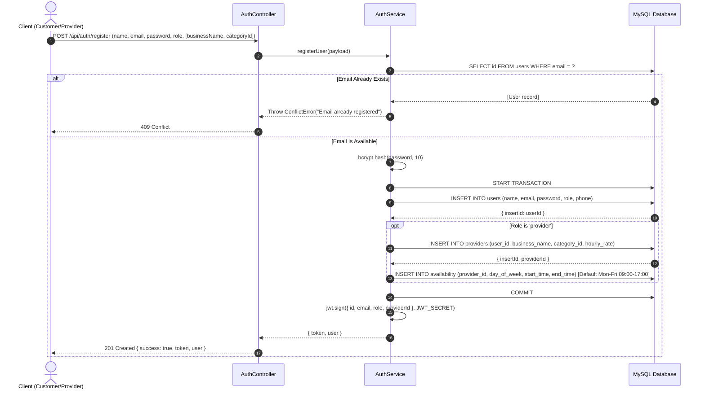
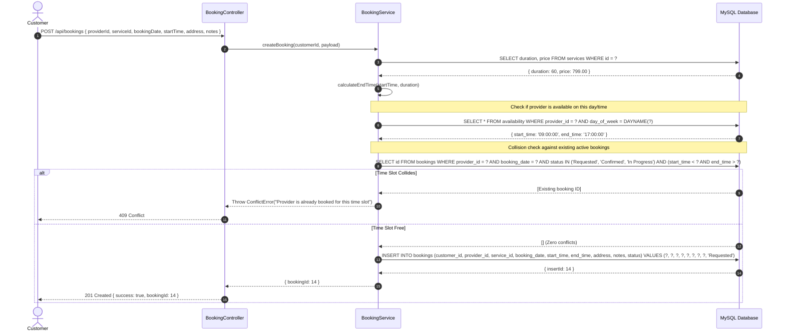
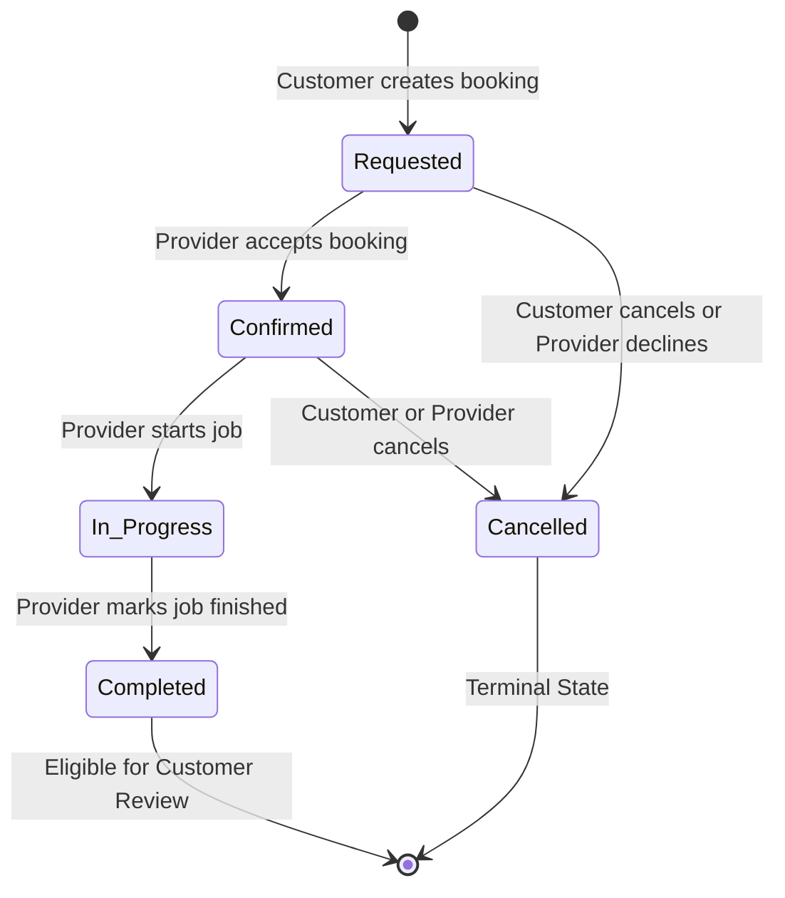
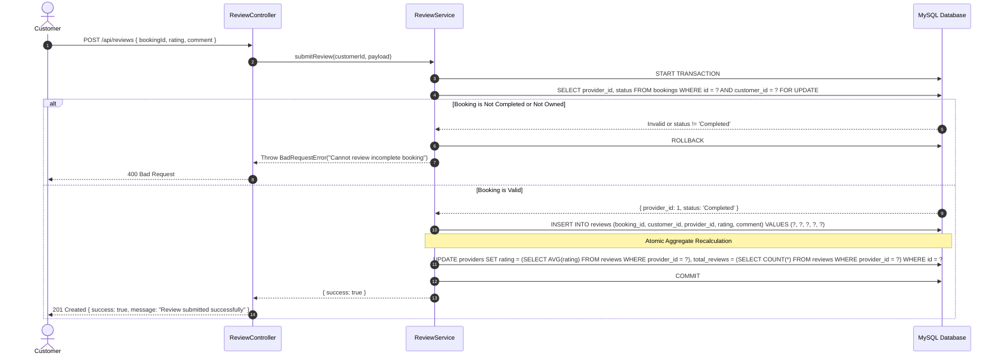

# Backend Workflows & Sequence Diagrams
## System Interactions & Lifecycle State Machines

---

## 1. Authentication & Registration Lifecycle

---

## 2. Booking Scheduling & Conflict Check Flow

---

## 3. Booking State Machine

### Transition Authorization Matrix

| Initial Status | Target Status | Allowed Actor | API Endpoint | Business Rule |
| :--- | :--- | :--- | :--- | :--- |
| `Requested` | `Confirmed` | Provider | `PUT /api/bookings/:id/status` | Provider agrees to perform service. |
| `Requested` | `Cancelled` | Customer / Provider | `PUT /api/bookings/:id/status` | Immediate release of calendar slot. |
| `Confirmed` | `In Progress` | Provider | `PUT /api/bookings/:id/status` | Provider has arrived on site. |
| `Confirmed` | `Cancelled` | Customer / Provider | `PUT /api/bookings/:id/status` | Cancellation before job commencement. |
| `In Progress`| `Completed` | Provider | `PUT /api/bookings/:id/status` | Job completed, triggers review eligibility. |

---

## 4. Transactional Review & Rating Recalculation Flow

