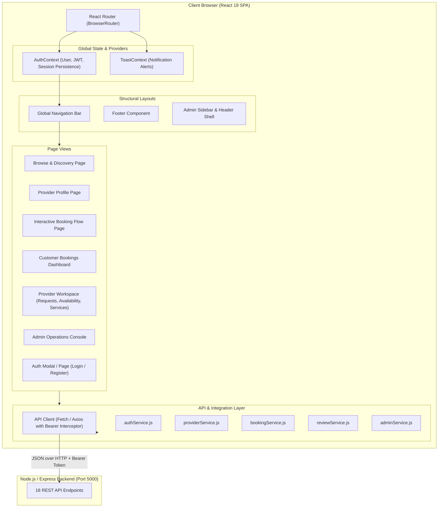

# Frontend System Design Document
## Service Marketplace & Booking Platform

---

## 1. Executive Summary & Design Vision

The **Service Marketplace & Booking Platform Frontend** is a responsive, single-page application (SPA) built on **React 19**, **Vite**, **TailwindCSS**, **Lucide Icons**, and **Recharts**. It is architected to deliver a fast, frictionless experience across three primary actor personas:
1. **Public / Prospective Customers:** Instant marketplace search, category filtering, transparent pricing, verified customer reviews, and interactive calendar slot booking.
2. **Service Providers:** A centralized business workspace to manage incoming requests, track earnings, update availability shifts, and configure offered services.
3. **Platform Administrators:** A governance console with live KPI metrics, user management, category administration, and review moderation.

---

## 2. High-Level Architecture & Component Hierarchy

The frontend architecture follows a modular, feature-oriented structure with clear separation between **Presentation (Components/Pages)**, **Global State (Contexts)**, and **Data Fetching (Services/API Client)**.

---

## 3. Design System & Visual Tokens

The user interface leverages an editorial, tactile aesthetic:
- **Surfaces & Background:** Warm linen (`#F5F2EA`), soft parchment (`#EDE8DA`), crisp surface cards (`#FFFFFF`).
- **Typography:**
  - Headlines & Accents: `Fraunces` (Editorial Serif)
  - Body & Interactive Elements: `Plus Jakarta Sans` / System Sans
- **Working Accents:**
  - Primary Action / Deep Teal: `#1F6E5E` (Hover: `#154E43`, Tint: `#E4EEE9`)
  - Secondary Accent / Burnt Clay: `#C1622F` (Tint: `#F5E4D9`)
  - Structural Dark Surface: `#12181B` (Ink: `#1B1F1C`)
  - Status Indicators:
    - `Requested` / Pending: Amber / Clay Tint (`#F5E4D9`, Text: `#8A481F`)
    - `Confirmed`: Teal Tint (`#E4EEE9`, Text: `#154E43`)
    - `In Progress`: Lavender Tint (`#EBE7F4`, Text: `#4A3E73`)
    - `Completed`: Emerald Tint (`#E4EEE9`, Text: `#154E43`)
    - `Cancelled`: Rose Tint (`#F3E1DA`, Text: `#A6432B`)

---

## 4. State Management Strategy

### 4.1 Global Session State (`AuthContext`)
- **State Properties:**
  - `user`: `{ id, name, email, role, phone, providerId }`
  - `token`: JWT string stored in `localStorage` (`service_marketplace_token`)
  - `isAuthenticated`: Boolean
  - `isLoading`: Initial hydration check
- **Methods:**
  - `login(email, password)`: Dispatches `POST /api/auth/login`, saves JWT, sets user.
  - `register(formData)`: Dispatches `POST /api/auth/register`, saves JWT, sets user.
  - `logout()`: Clears `localStorage`, resets user to `null`, redirects to `/`.

### 4.2 Local Page State
- Each page owns its local search queries, filter selections, active tab index, and form inputs.
- Loading spinners and error alert banners are rendered during network operations.

---

## 5. Security & Route Protection

1. **Token Persistence & Auto-Attachment:**
   - Every outgoing request to protected endpoints (`/api/bookings`, `/api/reviews`, `/api/admin/*`, `/api/providers/profile`) automatically appends `Authorization: Bearer <token>` via the centralized `api.js` client.
2. **Session Restoration:**
   - On page reload, `AuthContext` calls `GET /api/auth/me` with the stored token to hydrate active user claims and verify the token is not expired.
3. **Role Route Guards:**
   - `<ProtectedRoute allowedRoles={['admin']}>`: Unauthenticated visitors are prompted to log in; unauthorized roles are redirected to `/`.
   - `<ProtectedRoute allowedRoles={['provider']}>`: Restricts provider workspace to provider accounts.
